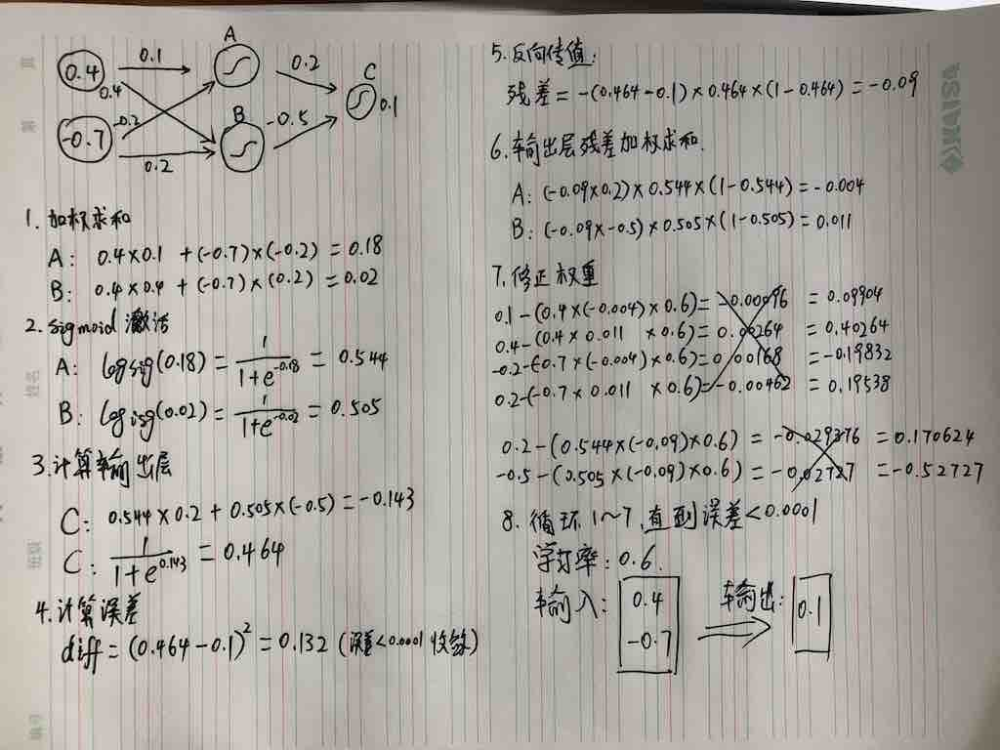
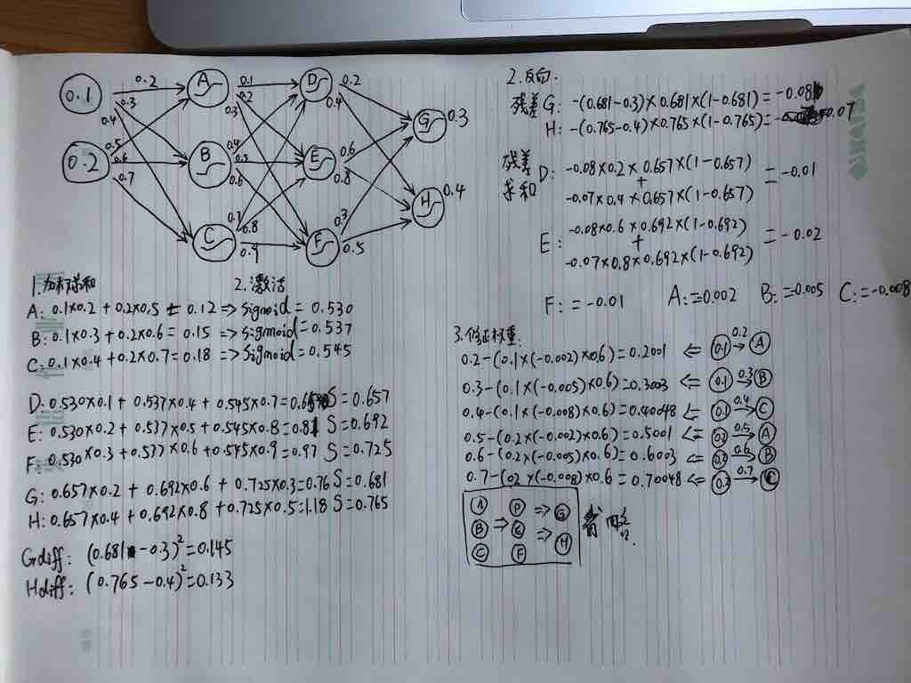

# 反向传播神经网络(Backpropagation Neural Network)算法演练与golang实现详解

## 教程样本

## 教程案例
0. 案例定义
    - 输入层：2个输入分别是0.4和-0.7
    - 隐藏层：1个隐藏层，2个神经元A和B
    - 输出层：1个输出C，训练值为0.1
    - 输入1到A、B的权重初始化分别是：0.1和0.4
    - 输入2到A、B的权重初始化分别是：-0.2和0.2
    - 隐藏层A、B到输出C的权重初始化分别是：0.2和-0.5
    - 学习速率设为0.6
    - 设定最小误差阀值为0.0001
0. 加权求和
    - 计算隐藏层A神经元的值：(0.4 * 0.1) + (-0.7 * -0.2) = 0.18
    - 计算隐藏层B神经元的值：(0.4 * 0.4) + (-0.7 * 0.2) = 0.02
0. 激活函数
    - 激活函数使用sigmoid：1 / (1 + math.Exp(-x))
    - A: sigmoid(0.18) = 1 / (1 + math.Exp(-0.18)) = 0.544
    - B: sigmoid(0.02) = 1 / (1 + math.Exp(-0.02)) = 0.505
0. 计算输出层
    - 加权求和C：(0.544 * 0.2) + (0.505 * -0.5) = -0.143
    - 激活C：sigmoid(-0.143) = 1 / (1 + math.Exp(0.143)) = 0.464
0. 计算误差
    - diff = math.Pow(0.464 - 0.1, 2) = 0.132
    - 当diff小于最小误差时即可收敛
0. 反向计算
    - 残差计算：-(0.464 - 0.1) * 0.464 * (1 - 0.464) = -0.09
0. 输入层残差值
    - A残差值：(-0.09 * 0.2) * 0.544 * (1 - 0.544) = -0.004
    - B残差值：(-0.09 * -0.5) * 0.505 * (1 - 0.505) = 0.011
0. 修正权重
    - 修正输入1到A的权重：0.1 - (0.4 * -0.004 * 0.6) = 0.09904
    - 修正输入1到B的权重：0.4 - (0.4 * 0.011 * 0.6) = 0.40264
    - 修正输入2到A的权重：-0.2 - (-0.7 * -0.004 * 0.6) = 0.19832
    - 修正输入2到B的权重：0.2 - (-0.7 * 0.011 * 0.6) = 0.19538
    - 修正A到C的权重：-0.2 - (0.544 * -0.009 * 0.6) = 0.17062
    - 修正B到C的权重：-0.5 - (0.505 * -0.009 * 0.6) = -0.52727
0. 循环上面过程，直到误差小于0.0001，即可收敛

## 测试样本

## 测试案例
0. 案例定义
    - 输入层：2个输入分别是0.1和0.2
    - 隐藏层1：3个神经元A、B、C
    - 隐藏层2：3个神经元D、E、F
    - 输出层：2个输出G、H，训练值分别是0.3、0.4
    - 输入1到A、B、C的权重初始化分别是：0.2、0.3、0.4
    - 输入2到A、B、C的权重初始化分别是：0.5、0.6、0.7
    - 隐藏层A到隐藏层D、E、F的权重初始化分别是：0.1、0.2、0.3
    - 隐藏层B到隐藏层D、E、F的权重初始化分别是：0.4、0.5、0.6
    - 隐藏层C到隐藏层D、E、F的权重初始化分别是：0.7、0.8、0.9
    - 隐藏层D到输出层G、H的权重初始化分别是：0.2、0.4
    - 隐藏层E到输出层G、H的权重初始化分别是：0.6、0.8
    - 隐藏层F到输出层G、H的权重初始化分别是：0.3、0.5
    - 学习速率设为0.6
    - 设定最小误差阀值为0.0001